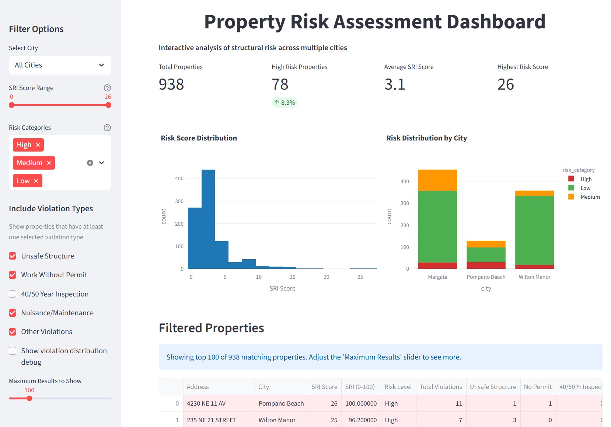
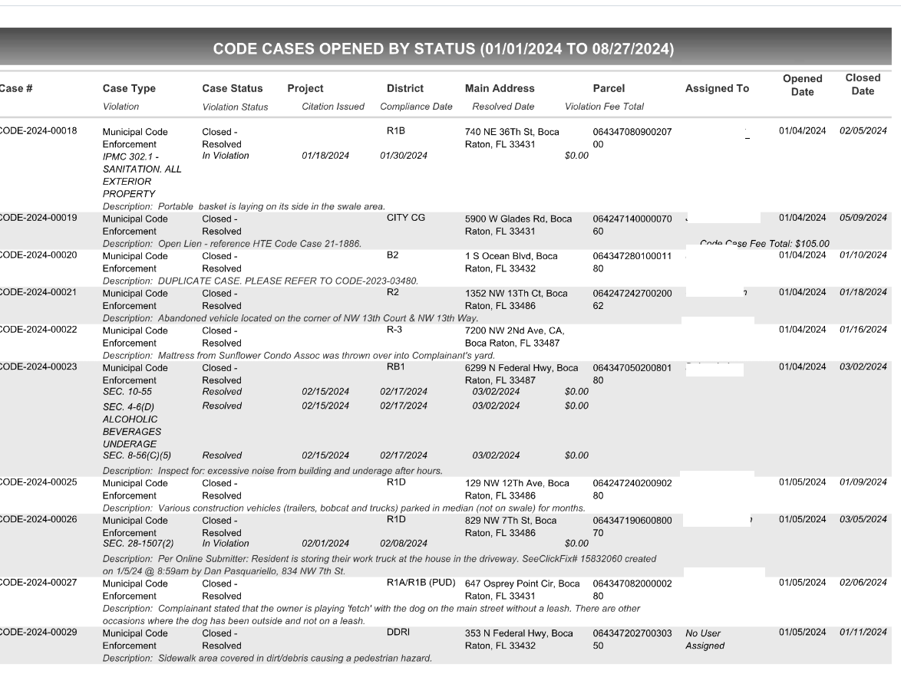
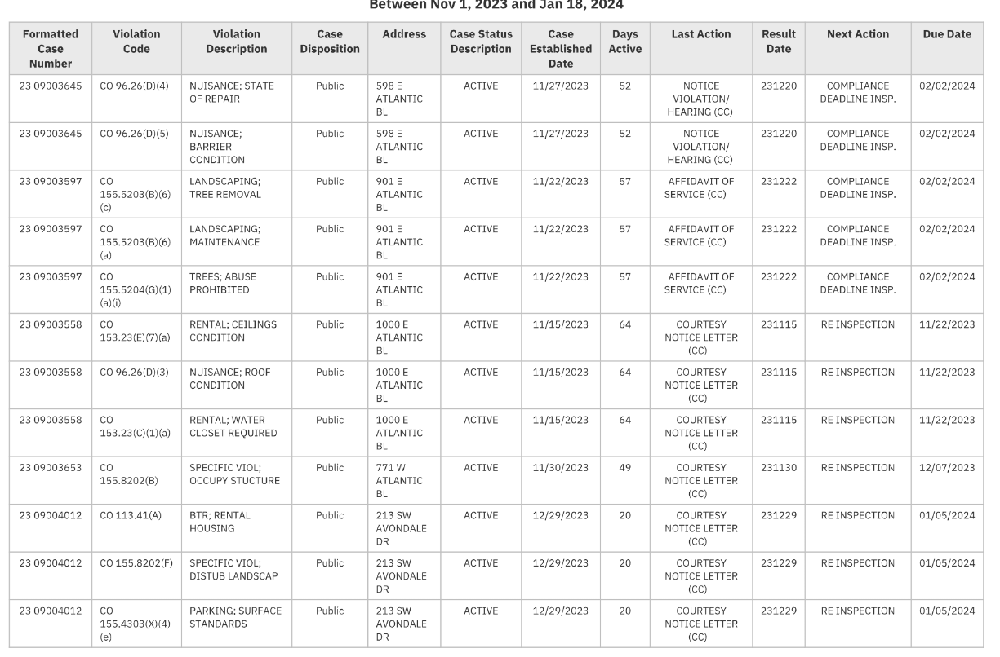
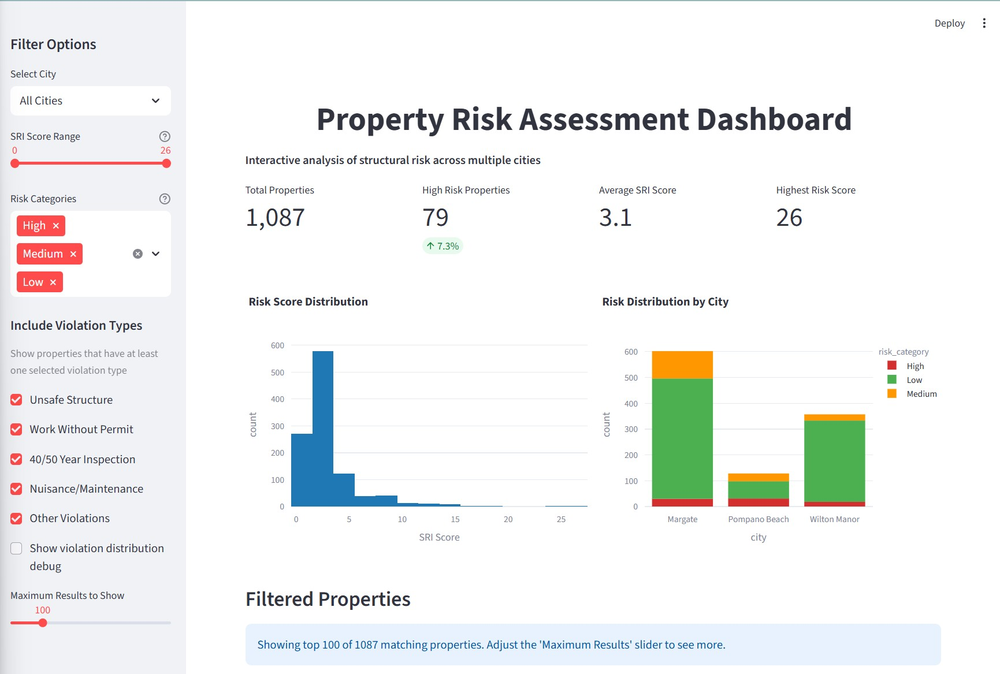
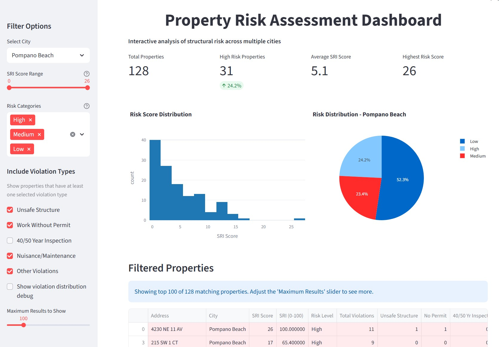

# Structural Risk Index

**Finding distressed properties in municipal code violation data.**

A data pipeline that extracts code violations from municipal PDF records across three South Florida cities, scores 1,089 properties with a weighted risk index, and surfaces the results in an interactive dashboard.

Built at **LandingAI Financial Hack NYC 2025**.

[**▶ Watch the demo**](https://youtu.be/ARuEhwtL-gg)



---

## Why I built it

I was helping a real estate investor find distressed properties worth approaching — the ones where an owner might be motivated to sell.

That information is public. Cities publish code violations: unsafe structures, work done without permits, failed inspections, maintenance notices. But it's published as PDFs, in a different format for every city, with no way to compare a property in Margate against one in Pompano Beach.

So the work was already being done by hand, one city at a time, and it didn't scale past a handful of properties.

This pipeline does it in bulk. It parses the violation records, normalizes them across jurisdictions, and ranks every property by a single comparable score — turning a public records search into a prioritized list of leads.

The same ranking is useful to more than investors: insurers pricing neighborhood risk, and city inspectors deciding where limited inspection budget should go.

---

## The extraction problem

Every city publishes this data. No two publish it the same way.

| City | Format |
|---|---|
| **Margate** | Fixed-width text from a mainframe report generator (`CE305L`) — monospaced columns, no delimiters |
| **Pompano Beach** | Clean tabular export with labelled columns |
| **Wilton Manors** | Tabular, with its own column naming |
| **Boca Raton** | 285-page status-grouped report; violation rows nested under case rows, descriptions inline as free text |
| **Oakland Park** | 325 pages, same nested structure, different field names |

I used **LandingAI's Agentic Document Extraction** to parse them, since the hackathon was built around it.

Three cities extracted cleanly. Boca Raton and Oakland Park did not: their nested row structure and inline descriptions meant related fields landed in the wrong records, and correcting that needed more parser configuration than the hackathon window allowed.

So the analysis covers three of the five cities collected — the raw source documents for all five are in `input_folder/`.

The two that failed are the more interesting ones. They aren't badly formatted by accident; they're formatted for a person reading a printed report, with visual grouping standing in for structure. That's a different problem from parsing a table, and it's the normal condition of public records rather than the exception.

---
<table>
<tr>
<td width="50%"></td>
<td width="50%"></td>
</tr>
<tr>
<td align="center"><em>Boca Raton — cases grouped by status, violations nested, descriptions inline. Extraction failed here.</em></td>
<td align="center"><em>Pompano Beach — one row per violation, labelled columns. Extracted cleanly.</em></td>
</tr>
</table>

## The Structural Risk Index

Each property receives a score based on the type and number of violations against it.

```text
SRI = Σ(violation weight × count) + multiple-violation bonus

where the bonus = max(0, total violations − 1) × 1
```

| Violation type | Weight | Rationale |
|---|---|---|
| Unsafe structure | +5 | Critical structural integrity issue |
| 40/50-year inspection | +3 | Mandatory aging-building safety review |
| Work without permit | +2 | Unauthorized modification, compliance risk |
| Nuisance / maintenance | +1 | Deterioration indicator |
| Each additional violation | +1 | Repeat-offender pattern |

**Risk bands:** High ≥ 8 · Medium 4–7 · Low < 4

### On the weights

These weights are assigned by judgment, not learned from data. They reflect how municipalities themselves prioritize violations — an unsafe-structure citation is a more serious signal than a maintenance notice — and the multiple-violation bonus captures the pattern that repeat offenders tend to be genuinely distressed rather than incidentally cited.

They have **not** been calibrated against outcomes. Validating the weights against actual sales, foreclosures, or inspection findings would be the natural next step, and would turn this from a reasonable heuristic into a measured one.

---

## What the data showed

**1,089 properties across three cities**

| City | Properties | High risk (8+) | Avg SRI | Max SRI | Risk density |
|---|---|---|---|---|---|
| Pompano Beach | 130 | 31 (23.8%) | 5.00 | 26 | 2.91 |
| Margate | 602 | 30 (5.0%) | 3.15 | 15 | 1.11 |
| Wilton Manors | 357 | 18 (5.0%) | 2.33 | 25 | 1.59 |

**Pompano Beach has roughly five times the concentration of high-risk properties** as the other two cities — 23.8% against 5.0%. Risk density varies just as sharply, 2.91 against 1.11.

That gap is the most useful output. For someone sourcing leads, it says where to look first. Whether it reflects genuinely worse building stock or simply more aggressive code enforcement is an open question, and one worth answering before drawing conclusions about the properties themselves.

**Violation distribution**

| Category | Share of risk factors |
|---|---|
| Building safety inspection | 27.0% |
| Work without permit | 10.7% |
| Nuisance / maintenance | 9.6% |
| Unsafe structure | 7.1% |
| Other | 45.5% |



---

## Dashboard



- Filter by city, risk score, and violation type
- Risk distribution histograms and city comparisons
- Sortable, colour-coded property table with violation breakdowns
- CSV export honouring the active filters

---

## Running it

**Requirements:** Python 3.8+, a web browser.

```bash
git clone https://github.com/edilma/coderisk-sf
cd coderisk-sf

python -m venv .venv
.venv\Scripts\activate          # Windows
source .venv/bin/activate       # macOS / Linux

pip install streamlit plotly pandas numpy
```

**Launch the dashboard:**

```bash
streamlit run streamlit_app/app.py
```

Opens at `http://localhost:8501` with all 1,089 scored properties loaded.

**Explore the analysis:**

```bash
pip install jupyter landingai-ade python-dotenv
jupyter notebook src/3_financial_analysis.ipynb
```

The notebook contains the full pipeline: data loading, SRI calculation, and the visualizations.

---

## Project structure

```text
coderisk-sf/
├── streamlit_app/
│   ├── app.py                              # Dashboard
│   └── README.md
├── src/
│   └── 3_financial_analysis.ipynb          # SRI implementation
├── clean_data/
│   ├── structural_risk_index_results.csv   # Scored properties
│   ├── margate_clean.csv
│   ├── pompano_beach_clean.csv
│   └── wilton_manor_clean.csv
├── input_folder/                           # Source municipal PDFs
├── results_folder/                         # Pipeline outputs
├── cleaning/                               # Per-city processing
└── requirements.txt
```

---

## Limitations

- **The weights are unvalidated.** They're informed judgment, not fitted to outcome data. See the note above.
- **Three cities of five.** Boca Raton and Oakland Park were collected but not extracted cleanly in time. Their inclusion would roughly triple the dataset.
- **One county.** Whether the scoring generalizes beyond Broward County is untested.
- **Violation records reflect enforcement, not condition.** A city that inspects aggressively produces more violations than one that doesn't, which may explain part of the Pompano Beach gap.
- **Point-in-time snapshot.** The data isn't refreshed automatically; rerunning the pipeline requires new source PDFs.
- **Per-city cleaning is bespoke.** Each municipality publishes a different format, so adding a city means writing a new cleaning step.

---

## License

MIT — see [LICENSE](LICENSE).
